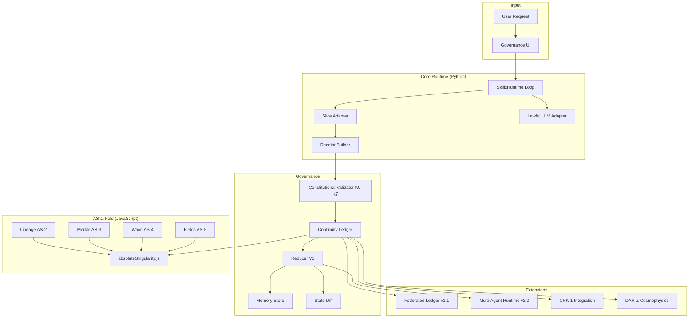

# SkillzMcGee Blueprint

**Version:** 1.1 + AS-Ω  
**Repo:** https://github.com/warheart1984-ctrl/SkillzMcgee  
**Purpose:** Constitutional cognitive runtime — governed execution with verifiable receipts, deterministic state, and lawful LLM cognition.

Use this document as the single source of truth when extending, reviewing, or implementing SkillzMcGee with Copilot or any other agent.

---

## 1. Executive Summary

SkillzMcGee is **not** a workflow logger. It is a **governed agent runtime** where:

- Every action produces a **Merkle-linked receipt**
- World state is **always derived** from the ledger: `state = reduce(ledger)`
- A **constitutional validator** enforces invariants before commit
- LLM calls are **state-aware, history-aware, and logged**
- A **singularity fold** (AS-Ω) compresses the ledger into a tamper-evident fingerprint

**Core guarantee:** No hidden state. No untracked cognition. Tamper-evident continuity.

---

## 2. Design Principles

| Principle | Rule |
|-----------|------|
| Append-only | Ledger never overwrites or deletes entries |
| Deterministic reducibility | `state = reduce(ledger)` always |
| Receipt-first | Every slice run, LLM call, and agent action → receipt |
| Constitutional gate | No receipt commits without validator pass |
| Lawful LLM | LLM receives state + recent receipts; cannot contradict either |
| Federated sovereignty | Each node owns its chain; peers verify signatures |
| CRK-1 compatible | Receipts map to CRK-1 format for kernel integration |

---

## 3. System Architecture



---

## 4. Repository Layout

```
skillzmcgee/
├── main.py                          # CLI entry
├── package.json                     # Node tests + AS-Ω
├── requirements.txt                 # Python deps (PyYAML)
├── config/
│   ├── constitution.yaml            # K0-K7 + slice schemas + LLM contract
│   └── settings.yaml                # ledger path, memory path, node_id
├── core/
│   ├── runner.py                    # SkillzRuntime + canonical loop
│   ├── workflow.py                  # Facade
│   ├── config.py                    # YAML loader
│   ├── receipts.py                  # build_receipt()
│   └── adapters/
│       ├── slice_adapter.py         # Route to slice handlers
│       └── llm_adapter.py           # Lawful LLM wrapper
├── governance/
│   ├── continuity_ledger.py         # Append-only Merkle chain
│   ├── merkle.py                    # SHA-256 hashing (Python)
│   ├── reducer.py                   # ReducerV3 multi-slice world model
│   ├── validator.py                 # ConstitutionalValidator
│   ├── memory.py                    # Persisted state JSON
│   ├── diff.py                      # deep_diff for UI / rollback preview
│   ├── state_accumulator.py         # In-memory slice state (v0.2)
│   ├── multi_agent.py               # v2.0 scheduler + intent graph
│   └── constitution/
│       ├── invariants.py            # K0-K7 checks
│       ├── schemas.py               # Slice schema validation
│       └── contracts.py             # Constitution dataclass
├── slices/
│   └── __init__.py                  # slice_math, slice_research, slice_system, slice_custom
├── federation/
│   └── federated_ledger.py          # Signed cross-node receipts
├── crk1/
│   └── integration.py               # CRK-1 receipt/reducer/validator mapping
├── darz/
│   └── cosmophysics.py              # Cosmophysics reducer + C0-C5
├── ui/
│   └── governance_ui.py             # CLI governance console
├── src/singularity/                 # AS-Ω (JavaScript)
│   ├── lineage.js                   # AS-2 parentId / lineageId / depth
│   ├── merkle.js                    # AS-3 hashReceipt + merkleRoot
│   ├── nonlinearWave.js             # AS-4 wave dynamics
│   ├── darzFields.js                # AS-5 field equations
│   ├── absoluteSingularity.js       # AS-Ω fold orchestrator
│   └── index.js                     # Public exports
└── tests/
    ├── test_skillzmcgee.py          # Python tests
    └── singularity.test.js          # Node tests (8 passing)
```

---

## 5. Canonical Runtime Loop

**File:** `core/runner.py` → `SkillzRuntime.process_request()`

```
1. Execute slice        → slice_adapter.run(slice, input)
2. Build receipt        → build_receipt(slice, input, output, actor)
3. Validate             → validator.validate(receipt, state, ledger)
4. Append to ledger     → ledger.append(receipt)  // assigns id, parent, merkle
5. Recompute state      → state = reducer.reduce(ledger)
6. Persist memory       → memory.save(state)
7. Update UI            → ui.update(receipt, state)  // includes diff
```

**Boot sequence:**

```
load_config()
→ ContinuityLedger(path)
→ ConstitutionalValidator(constitution)
→ ReducerV3()
→ state = reducer.reduce(ledger)
→ MemoryStore.save(state)
→ LawfulLLMAdapter(llm, ledger, state, constitution)
→ SliceAdapter()
→ GovernanceUI(ledger, state)
```

---

## 6. Receipt Schema

Every committed receipt:

```json
{
  "id": "<sha256(payload)>",
  "parent": "<previous_receipt_id or null>",
  "timestamp": 1719360000.0,
  "slice": "slice_math",
  "actor": "skillz",
  "input": "2+2",
  "output": 4,
  "status": "ok",
  "merkle": {
    "self": "<id>",
    "parent": "<parent or null>"
  },
  "invariants_passed": ["K0", "K1", "K2", "K3"],
  "diff": { "added": {}, "removed": {}, "changed": {} }
}
```

**Hash input (deterministic):** `slice`, `actor`, `input`, `output`, `timestamp` — JSON sorted keys, SHA-256.

**Federated extension (v1.1):**

```json
{
  "node_id": "skillz-local-001",
  "receipt_id": "<hash>",
  "signature": "<hmac-sha256>",
  "federated_parent_id": "<optional foreign receipt>",
  "payload": { "slice", "actor", "input", "output", "status", "timestamp" }
}
```

---

## 7. State Model (Reducer V3)

```python
state = {
    "slices": {
        "slice_math": {
            "last_output": 4,
            "last_status": "ok",
            "valid": True
        },
        "slice_research": {
            "last_output": {...},
            "history": ["receipt_id_1", "receipt_id_2"]
        },
        "slice_system": {
            "health": "ok",
            "last_run": "<receipt_id>"
        }
    },
    "agents": {
        "skillz": {
            "last_action": "<receipt_id>",
            "last_slice": "slice_math"
        }
    },
    "system": {
        "run_count": 42,
        "last_receipt": "<receipt_id>"
    }
}
```

**Contract:** `state = reduce(ledger)` — never mutate state directly except via reducer replay.

---

## 8. Constitution (K0–K7)

**File:** `config/constitution.yaml`

| Invariant | Meaning |
|-----------|---------|
| **K0** | Every receipt has required fields (id, parent, timestamp, slice, input, output, status, merkle) |
| **K1** | Ledger is append-only — no overwrites, deletes, reordering |
| **K2** | Merkle integrity — `receipt.id == hash(payload)`, parent chain valid |
| **K3** | State derivable from ledger — `run_count == len(ledger)` |
| **K4** | Deterministic slices — same input → same output |
| **K5** | LLM outputs logged, schema-valid, context-bound |
| **K6** | No contradictory state transitions — schema types respected |
| **K7** | All slices declare schemas in constitution |

**Slice config example:**

```yaml
slices:
  slice_math:
    deterministic: true
    schema:
      last_output: str
      last_status: str
```

---

## 9. Slices

| Slice ID | Handler | Deterministic | Notes |
|----------|---------|---------------|-------|
| `slice_math` | Safe AST eval | Yes | `input`: expression string |
| `slice_research` | Stub summary | No | Returns citations list |
| `slice_system` | Health check | Yes | Returns `{ health: "ok" }` |
| `slice_custom` | Passthrough | No | Extension point |

**Add a slice:** Register handler in `slices/__init__.py` → `SLICE_REGISTRY`, add schema to `constitution.yaml`, optional custom reducer in `ReducerV3.slice_reducers`.

---

## 10. Lawful LLM Adapter

**File:** `core/adapters/llm_adapter.py`

Every LLM call must include:

```
State:      { slice state JSON }
History:    { last 5 receipts }
Task:       { user prompt }
Rules:      no contradict state, no contradict receipts
```

**Contract (from constitution):**

- `require_state_context: true`
- `require_history_context: true`
- `forbid_contradictions: true`
- `log_all_outputs: true` → every LLM response becomes a receipt

---

## 11. AS-Ω Singularity Fold

**Language:** JavaScript (Node 18+)  
**Entry:** `import { foldSingularity } from "./src/singularity/index.js"`

**Pipeline:**

```
ledger
  → attachLineage()      // AS-2: parentId, lineageId, depth
  → hashReceipt()        // AS-3: per-receipt hash
  → merkleRoot()         // AS-3: global + per-lineage roots
  → integrateWave()      // AS-4: amplitude + momentum
  → solveFields()        // AS-5: failure / environment / salience fields
  → fingerprint          // AS-Ω: hash(globalRoot + wave + counts)
```

**Output:**

```javascript
{
  fingerprint: "<sha256>",
  merkle: {
    globalRoot: "<hash>",
    lineageRoots: { "<lineageId>": "<hash>" },
    receiptHashes: ["...", "..."]
  },
  wave: { amplitude: 0.12, momentum: 0.45 },
  darz: {
    failure: [{ t: 0, value: 0 }],
    environment: [{ t: 0, value: 0 }],
    salience: [{ t: 0, value: 0.5 }]
  },
  lineages: { "<lineageId>": [ receipts ] },
  ledger: [ receipts with lineage attached ],
  meta: { version: "AS-Ω", receiptCount: N }
}
```

---

## 12. Federation (v1.1)

**File:** `federation/federated_ledger.py`

Each node is sovereign:

```
Node A: a1 → a2 → a3
Node B: b1 → b2
Node C: c1 → c2 → c3 → c4
```

**Operations:**

| Op | Description |
|----|-------------|
| `publish` | Sign + append to local chain |
| `verify_foreign` | HMAC signature + Merkle check |
| `ingest_peer_chain` | Merge verified foreign receipts into federated index |
| `federated_merkle_root` | Root over local + known foreign ids |
| `cross_node_refs` | List `federated_parent_id` links |

---

## 13. Multi-Agent Runtime (v2.0)

**File:** `governance/multi_agent.py`

State evolves to:

```
state.agents
state.capabilities
state.intent_graph
state.interactions
```

**Loop:**

```
1. Observe state + intents
2. ConstitutionalScheduler selects agent under invariants
3. Execute action (slice / tool / message)
4. Emit agent_receipt
5. Update state via reducer
6. Re-evaluate intents
```

**Primitives:** `AgentManifest`, `IntentGraph`, `ConstitutionalScheduler`, `MultiAgentRuntime`

---

## 14. CRK-1 Integration

**File:** `crk1/integration.py`

| Skillz | CRK-1 |
|--------|-------|
| `receipt.slice` | `receipt.domain` |
| `ContinuityLedger` | CRK-1 continuity substrate |
| `ReducerV3.reduce()` | `fold(ledger)` |
| `ConstitutionalValidator` | CRK-1 constitutional validator |
| Skillz agents | CRK-1 cognitive actors |

**Mapping functions:** `to_crk1_receipt()`, `from_crk1_receipt()`, `CRK1ContinuityAdapter`, `CRK1ReducerModule`, `CRK1ValidatorAdapter`

---

## 15. DAR-Z Cosmophysics Bridge

**File:** `darz/cosmophysics.py`

```python
cosmic_state = {
    "epochs": [...],
    "worldlines": { id: { receipts, merkle_chain } },
    "fields": { field_name: value },
    "agents": { agent_id: { worldline, ... } }
}
```

**Invariants:**

| ID | Rule |
|----|------|
| C0 | Worldlines cannot branch/merge without continuity receipt |
| C1 | Epochs strictly ordered — no retroactive insertion |
| C2 | Field updates respect cosmophysics laws |
| C3 | Agents act only within valid worldlines/epochs |
| C4 | Timeline receipts Merkle-linked per worldline |
| C5 | Every cosmophysics receipt is CRK-1 compatible |

---

## 16. Data Flow (End-to-End)

```
User: "slice_math 2+2"
        │
        ▼
┌─────────────────┐
│  Slice Adapter  │  output = 4
└────────┬────────┘
         ▼
┌─────────────────┐
│ Receipt Builder │  { slice, input, output, status, timestamp }
└────────┬────────┘
         ▼
┌─────────────────┐
│   Validator     │  K0-K7 check → invariants_passed
└────────┬────────┘
         ▼
┌─────────────────┐
│ Continuity      │  append → id, parent, merkle
│ Ledger          │
└────────┬────────┘
         ▼
┌─────────────────┐
│  Reducer V3     │  state = reduce(ledger)
└────────┬────────┘
         ├──────────► MemoryStore (persist)
         ├──────────► GovernanceUI (receipt + diff)
         └──────────► foldSingularity(ledger) → ASΩ fingerprint
```

---

## 17. Extension Guide (for Copilot)

### Add a new slice

1. Create handler in `slices/__init__.py`
2. Register in `SLICE_REGISTRY`
3. Add schema + `deterministic` flag in `config/constitution.yaml`
4. Optional: custom reducer method in `ReducerV3`
5. Add test in `tests/test_skillzmcgee.py`

### Wire real LLM

```python
def my_llm(prompt: str) -> str:
    # call OpenRouter, OpenAI, etc.
    return response

runtime = SkillzRuntime({**load_config(), "llm_fn": my_llm})
```

### Wire AS-Ω after each receipt

```javascript
import { foldSingularity } from "./src/singularity/index.js";
const asOmega = foldSingularity(ledger.entries);
console.log(asOmega.fingerprint);
```

### Add federation peer

```python
from federation.federated_ledger import FederatedLedger, NodeIdentity

node = NodeIdentity("node-a")
fed = FederatedLedger(node, "ledger.json")
receipt = fed.build_federated_receipt(slice_id="slice_math", ...)
fed.publish(receipt)
```

---

## 18. Commands

```bash
# Python runtime (interactive CLI)
pip install -r requirements.txt
python main.py

# Python tests
python tests/test_skillzmcgee.py

# AS-Ω singularity tests
npm test
```

**CLI examples:**

```
slice_math 10+5
{"slice": "slice_research", "input": "quantum continuity"}
quit
```

---

## 19. Persistence

| File | Contents |
|------|----------|
| `skillz_ledger.json` | Append-only receipt chain + merkle_root |
| `skillz_memory.json` | Last reduced state snapshot |

Both paths configurable in `config/settings.yaml`.

---

## 20. Roadmap (Not Yet Wired to Main Loop)

| Feature | Status | Module |
|---------|--------|--------|
| Unified runtime loop | ✅ Done | `core/runner.py` |
| AS-Ω singularity fold | ✅ Done | `src/singularity/` |
| Federation in main loop | 🔲 Stub | `federation/federated_ledger.py` |
| Multi-agent scheduler loop | 🔲 Stub | `governance/multi_agent.py` |
| AS-Ω auto-fold on commit | 🔲 Planned | bridge Python → Node |
| Web governance UI | 🔲 Planned | `ui/` |
| Merkle proof generation | 🔲 Planned | `governance/merkle.py` |

---

## 21. One-Line Pitch

**SkillzMcGee is a constitutional cognitive runtime where every action is a Merkle-linked receipt, state is always replayed from the ledger, LLM cognition is lawful and logged, and the entire history folds into a tamper-evident AS-Ω fingerprint.**

---

*Generated for Copilot / agent handoff. Keep this file in sync with `main` when architecture changes.*
