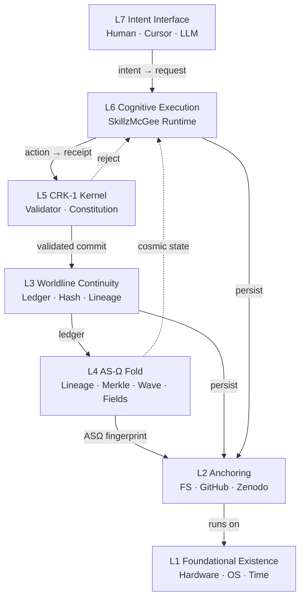

# Reality Stack v1.0 — Canonical Architecture

**Version:** 2.0 (FRS-1 Federation Layer)  
**Status:** Canonical / Publishable  
**Companion:** [BLUEPRINT.md](./BLUEPRINT.md) · [FRS-1_BLUEPRINT.md](./FRS-1_BLUEPRINT.md)  
**Repo:** https://github.com/warheart1984-ctrl/SkillzMcgee

A **7-layer governed cosmological runtime stack** for autonomous systems, agentic cognition, and persistent world simulation.

Every layer has a name, a role, concrete components, and a single function. Higher layers depend on lower layers; no layer skips its substrate.

---

## Stack Overview

```
┌─────────────────────────────────────────────────────────────┐
│  L8  Federation Layer (FRS-1)        Multi-node cosmos      │
├─────────────────────────────────────────────────────────────┤
│  L7  Intent Interface Layer          Human → artifacts      │
├─────────────────────────────────────────────────────────────┤
│  L6  Cognitive Execution Layer       Agents → receipts      │
├─────────────────────────────────────────────────────────────┤
│  L5  CRK-1 Constitutional Kernel      Law → validation       │
├─────────────────────────────────────────────────────────────┤
│  L4  AS-Ω Cosmological Fold Engine     Ledger → universe     │
├─────────────────────────────────────────────────────────────┤
│  L3  Worldline Continuity Layer        Truth → replay        │
├─────────────────────────────────────────────────────────────┤
│  L2  Anchoring Substrate               Persistence → archive │
├─────────────────────────────────────────────────────────────┤
│  L1  Foundational Existence Layer      Physics → compute     │
└─────────────────────────────────────────────────────────────┘
```

---

## Summary Table

| Layer | Name | Role |
|-------|------|------|
| **L8** | Federation Layer (FRS-1) | Multi-node continuity + cosmos exchange |
| **L7** | Intent Interface Layer | Human → system intent translation |
| **L6** | Cognitive Execution Layer | Agent runtime + task execution |
| **L5** | CRK-1 Constitutional Kernel | Governance + lawful behavior |
| **L4** | AS-Ω Cosmological Fold Engine | Cosmophysics + singularity fold |
| **L3** | Worldline Continuity Layer | Provenance + replayability |
| **L2** | Anchoring Substrate | Storage + archival permanence |
| **L1** | Foundational Existence Layer | Physical reality + compute |

---

## Layer 1 — Foundational Existence Layer (L1)

**Name:** Foundational Existence Layer  
**Role:** The base layer that everything else ultimately rests on — physical world, time, and causality.

### What it is

Computation is not abstract. It runs on silicon, consumes energy, advances in real time, and is subject to entropy. L1 is the irreducible floor beneath all governed runtime activity.

### Components

| Component | Description |
|-----------|-------------|
| Hardware | CPU, RAM, storage devices |
| OS | Windows, Linux — process scheduling, I/O |
| CPU cycles | Actual execution quanta |
| Real-world time | Monotonic clock, wall time |
| Entropy | Noise, failure, decay — the reason governance matters |

### Function

Provides the **physical substrate** that makes computation possible.

### SkillzMcGee mapping

- Host machine running `python main.py` or `node --test`
- `timestamp` fields on every receipt (wall-clock anchor)
- Non-deterministic failure modes → why K0–K7 and Merkle integrity exist

---

## Layer 2 — Anchoring Substrate (L2)

**Name:** Anchoring Substrate  
**Role:** Physical and cloud-based persistence — where artifacts live after execution.

### What it is

Governed runtimes produce receipts, state, and folds. L2 anchors those artifacts in durable storage and permanent scientific record so they survive process exit, machine reboot, and organizational change.

### Components

| Component | Path / Location | Purpose |
|-----------|-----------------|---------|
| Local filesystem | `E:\skillzmcgee\` | Dev runtime, ledger JSON, memory JSON |
| GitHub repository | `warheart1984-ctrl/SkillzMcgee` | Versioned source + history |
| Zenodo DOI archives | *(planned)* | Citable permanent archive |
| Ledger file | `skillz_ledger.json` | Append-only receipt chain |
| Memory file | `skillz_memory.json` | Reduced state snapshot |

### Function

Anchors the runtime in **real hardware** and **permanent scientific record**.

### SkillzMcGee mapping

- `governance/continuity_ledger.py` → `save()` to disk
- `governance/memory.py` → persisted state
- `config/settings.yaml` → configurable paths
- Git commits = L2 provenance over source code

---

## Layer 3 — Worldline Continuity Layer (L3)

**Name:** Worldline Continuity Layer  
**Role:** Every action is traceable, verifiable, and tamper-evident.

### What it is

The continuity substrate. Not a log file — a **worldline**: an ordered, hashed, lineage-linked chain of truth from which any past state can be replayed and any tamper detected.

### Components

| Component | Module | Spec |
|-----------|--------|------|
| Ledger | `governance/continuity_ledger.py` | Append-only receipt store |
| Hash chains | `governance/merkle.py` | SHA-256 over sorted JSON |
| Merkle trees | `governance/merkle.py`, `src/singularity/merkle.js` | Global + per-lineage roots |
| Lineage graphs | `src/singularity/lineage.js` | AS-2: parentId, lineageId, depth |
| Worldline ancestry | `darz/cosmophysics.py` | Per-worldline Merkle chains (C4) |
| Federation DAG | `federation/federated_ledger.py` | Cross-node continuity |

### Function

Provides **deterministic replay**, **integrity**, and **historical truth**.

### Core guarantee

```
state = reduce(ledger)     // always
ledger.verify_chain()      // tamper-evident
```

### Receipt chain (L3 primitive)

```
r0 (parent: null) → r1 (parent: r0) → r2 (parent: r1) → ...
```

---

## Layer 4 — AS-Ω Cosmological Fold Engine (L4)

**Name:** AS-Ω Cosmological Fold Engine  
**Role:** Physics-like computational substrate that collapses ledger history into a deterministic universe state.

### What it is

L3 stores the worldline. L4 **folds** it — compressing the entire governed history into cosmological primitives: lineage structure, Merkle roots, wave dynamics, and field equations. One fingerprint, one universe state.

### Sub-modules

| Spec | Module | Function |
|------|--------|----------|
| **AS-2** | `src/singularity/lineage.js` | Lineage cosmology — parentId, lineageId, depth |
| **AS-3** | `src/singularity/merkle.js` | Merkle continuity — hashReceipt, merkleRoot |
| **AS-4** | `src/singularity/nonlinearWave.js` | Nonlinear wave dynamics — salience/failure integration |
| **AS-5** | `src/singularity/darzFields.js` | DAR-Z field equations — failure, environment, salience |
| **AS-Ω** | `src/singularity/absoluteSingularity.js` | Absolute singularity fold — full orchestrator |

### Python bridge (DAR-Z cosmophysics)

| Module | Role |
|--------|------|
| `darz/cosmophysics.py` | Epochs, worldlines, fields, agents — C0–C5 invariants |

### Function

Transforms the entire runtime history into a **single governed cosmological state**.

### Fold pipeline

```
ledger
  → attachLineage()     [AS-2]
  → hashReceipt()       [AS-3]
  → merkleRoot()        [AS-3]
  → integrateWave()     [AS-4]
  → solveFields()       [AS-5]
  → fingerprint         [AS-Ω]
```

### ASΩ output

```javascript
{
  fingerprint,           // single universe identity
  merkle: { globalRoot, lineageRoots },
  wave: { amplitude, momentum },
  darz: { failure[], environment[], salience[] },
  lineages: { ... }
}
```

---

## Layer 5 — CRK-1 Constitutional Kernel (L5)

**Name:** CRK-1 Constitutional Runtime Kernel  
**Role:** Governance layer that constrains, validates, and interprets agent behavior.

### What it is

CRK-1 is the **law** of the runtime. No receipt commits without passing constitutional invariants. No LLM call escapes logging. No state transition contradicts schema.

### Components

| Component | Module | Role |
|-----------|--------|------|
| CRK-1 ruleset | `crk1/integration.py` | Receipt/reducer/validator mapping |
| Constitutional invariants | `governance/constitution/invariants.py` | K0–K7 enforcement |
| Receipt validation | `governance/validator.py` | Pre-commit gate |
| Governance envelope | `config/constitution.yaml` | Declarative law |
| Slice schemas | `governance/constitution/schemas.py` | Typed state contracts |
| LLM contract | `governance/constitution/contracts.py` | C1–C5 lawful cognition |

### Invariants (K0–K7)

| ID | Law |
|----|-----|
| K0 | Every receipt valid |
| K1 | Ledger append-only |
| K2 | Merkle hashes match |
| K3 | State derivable from ledger |
| K4 | Deterministic slices invariant |
| K5 | LLM outputs logged + schema-valid |
| K6 | No contradictory state transitions |
| K7 | All slices declare schemas |

### Function

Ensures all agent behavior is **lawful**, **auditable**, and **replayable**.

### CRK-1 mapping

| SkillzMcGee | CRK-1 |
|-------------|-------|
| Receipt | CRK-1 receipt (id, parent, invariants_passed, diff, signature) |
| ReducerV3 | CRK-1 reducer module — `state = fold(ledger)` |
| ConstitutionalValidator | CRK-1 constitutional validator |
| ContinuityLedger | CRK-1 continuity substrate |
| Agents | CRK-1 cognitive actors |

---

## Layer 6 — Cognitive Execution Layer (L6)

**Name:** Cognitive Execution Layer  
**Role:** Active runtime where agents, workflows, and tasks execute.

### What it is

L5 governs. L6 **acts**. Slices run, LLMs respond, agents coordinate, and every action emits a receipt that falls through to L3 and folds up to L4.

### Components

| Component | Module | Language |
|-----------|--------|----------|
| SkillzMcGee Python runtime | `core/runner.py`, `main.py` | Python |
| SkillzMcGee JS runtime | `src/singularity/` | JavaScript |
| Task orchestrators | `core/workflow.py` | Python |
| Slice handlers | `slices/__init__.py` | Python |
| Ledger writers | `governance/continuity_ledger.py` | Python |
| Multi-agent runtime | `governance/multi_agent.py` | Python |
| Federated nodes | `federation/federated_ledger.py` | Python |
| Governance UI | `ui/governance_ui.py` | Python |

### Canonical execution loop (L6)

```
1. Receive request
2. Execute slice / agent action
3. Build receipt
4. Validate (L5)
5. Append to ledger (L3)
6. Reduce state
7. Persist (L2)
8. Fold singularity (L4) — optional / planned auto-wire
9. Update operator surface (L7)
```

### Function

Executes actions that become **governed receipts**.

---

---

## Layer 8 — Federation Layer (L8) — FRS-1

**Name:** Federated Reality Stack (FRS-1)  
**Role:** Multi-node continuity, cosmos exchange, worldline migration, reconciliation, genesis.

### Components

| Module | Path | Role |
|--------|------|------|
| frs_identity | `src/federation/frs_identity/` | Node passport + fingerprint |
| frs_exchange | `src/federation/frs_exchange/` | Signed envelope protocol |
| frs_continuity | `src/federation/frs_continuity/` | Global Merkle + federated lineage |
| frs_migration | `src/federation/frs_migration/` | Cross-node worldline movement |
| frs_reconcile | `src/federation/frs_reconcile/` | Conflict detection + resolution |
| frs_genesis | `src/federation/frs_genesis/` | Multi-cosmos coordinated resets |
| Orchestrator | `src/federation/frs.js` | Boot, fold, publish, ingest |

### Function

Turns isolated nodes into a **federated cosmology** — sync, compare, and exchange worldlines.

See [FRS-1_BLUEPRINT.md](./FRS-1_BLUEPRINT.md) for full spec.

---

## Layer 7 — Intent Interface Layer (L7)

**Name:** Intent Interface Layer  
**Role:** Human + tool interface where architectural intent becomes executable artifacts.

### What it is

The top of the stack. Humans express intent; tools fabricate structure; LLMs expand patterns into specs and code. L7 is where **will** enters the governed system.

### Components

| Component | Role in stack |
|-----------|---------------|
| Human operator | Source of architectural intent |
| Cursor | Code fabrication, agent orchestration |
| LLMs | Pattern expansion, spec synthesis |
| Copilot / agents | Read BLUEPRINT.md + REALITY_STACK.md → implement |
| BLUEPRINT.md | Implementation blueprint for agents |
| REALITY_STACK.md | This document — canonical layer map |

### Function

Translates human intent into **structured, governed system inputs**.

### L7 → L6 handoff

```
Human intent
  → spec / prompt / JSON request
  → SkillzMcGee CLI or API
  → slice_adapter.run(slice, input)
  → receipt chain begins (L3)
```

---

## Cross-Layer Data Flow



---

## Layer Dependency Rules

1. **No skip layers** — L6 cannot commit without L5 validation; L4 cannot fold without L3 ledger.
2. **Downward authority** — Lower layers constrain upper layers (L1 entropy limits L2 durability; L3 integrity limits L4 fold truth).
3. **Upward derivation** — Upper layers derive from lower (L6 state from L3 ledger; L4 fingerprint from L3 hashes).
4. **Single source of truth** — L3 ledger is canonical history; everything else is derived or anchored.

---

## Publication Metadata

```yaml
title: "Reality Stack v1.0 — Canonical Architecture"
version: "1.0"
author: "Jon / warheart1984-ctrl"
implementation: "SkillzMcGee v1.1 + AS-Ω"
license: MIT
layers: 7
stack_type: governed_cosmological_runtime
keywords:
  - constitutional runtime
  - agentic cognition
  - Merkle continuity
  - cosmophysics fold
  - CRK-1
  - world simulation
  - provenance
```

---

## One-Page Stack (for slides / Zenodo abstract)

> **Reality Stack v1.0** is a 7-layer architecture for governed autonomous systems.
>
> **L1** grounds computation in physical reality. **L2** anchors artifacts in filesystem, Git, and DOI archives. **L3** provides tamper-evident worldline continuity via Merkle-linked ledgers. **L4** folds history into a cosmological state through AS-Ω (lineage, Merkle, wave dynamics, DAR-Z fields). **L5** enforces constitutional law via CRK-1 invariants. **L6** executes agentic cognition through SkillzMcGee. **L7** translates human intent into governed inputs via operator tools and LLMs.
>
> Core guarantee: `state = reduce(ledger)`. No hidden state. No untracked cognition. One fingerprint for the entire universe of execution.

---

## Implementation Status

| Layer | Status | Primary artifact |
|-------|--------|------------------|
| L7 | ✅ Active | Cursor + BLUEPRINT.md + this doc |
| L6 | ✅ Implemented | `core/runner.py`, `main.py`, `src/singularity/` |
| L5 | ✅ Implemented | `governance/validator.py`, `config/constitution.yaml` |
| L4 | ✅ Implemented | `src/singularity/absoluteSingularity.js`, `darz/cosmophysics.py` |
| L3 | ✅ Implemented | `governance/continuity_ledger.py`, `federation/` |
| L2 | ✅ Partial | Local FS + GitHub; Zenodo planned |
| L1 | ✅ Implicit | Host hardware (always present) |

---

## Related Documents

| Document | Scope |
|----------|-------|
| [BLUEPRINT.md](./BLUEPRINT.md) | SkillzMcGee implementation detail — modules, schemas, extension guide |
| [FRS-1_BLUEPRINT.md](./FRS-1_BLUEPRINT.md) | Federated Reality Stack Phase I — multi-node spec |
| [README.md](./README.md) | Quick start + test commands |
| [config/constitution.yaml](./config/constitution.yaml) | L5 declarative law |

---

*Reality Stack v1.0 — canonical, layered, coherent, publishable.*
