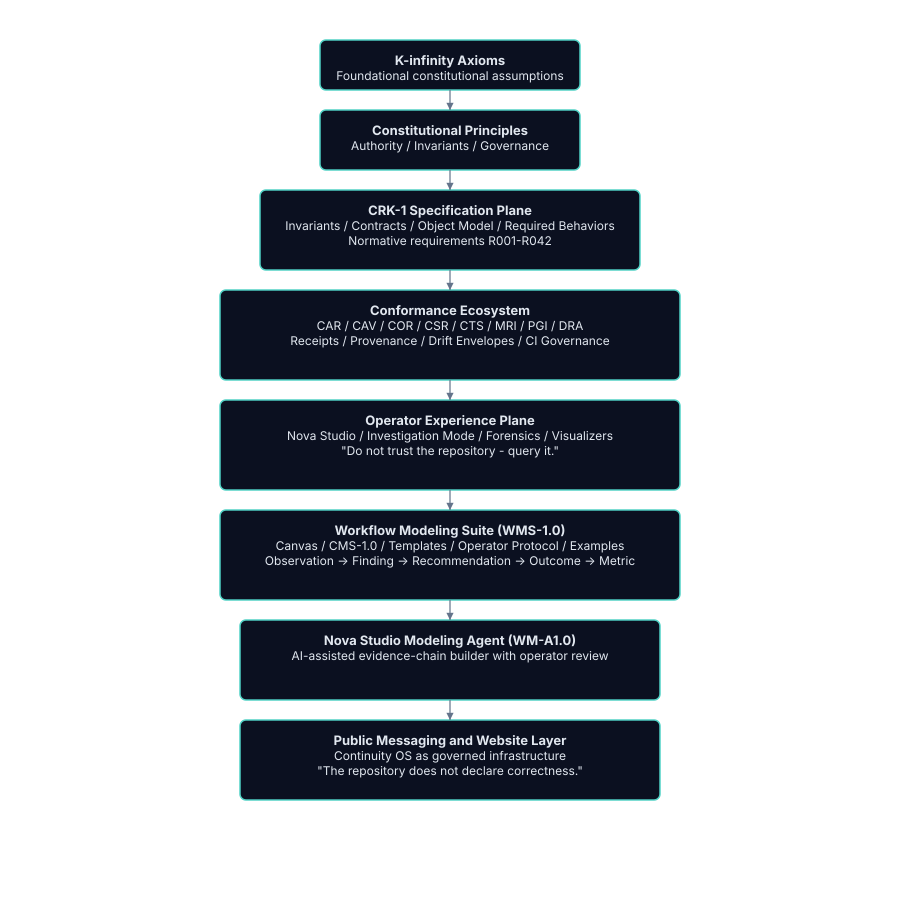

# Continuity OS - Version 1.0

A constitutional runtime designed for governed, traceable, and reproducible intelligent systems.

Continuity OS does not replace AI models. It provides the governed execution, evidence, provenance, and accountability layer that intelligent systems can build upon.

---

## Why Continuity OS Exists

Most intelligent systems are powerful but opaque. They act, decide, and adapt, but they rarely explain themselves in a way that can be audited, reproduced, or trusted.

Continuity OS changes that by making evidence the primary interface:

- Every decision produces an outcome.
- Every outcome produces evidence.
- Every evidence produces interpretation.
- Every interpretation feeds governance.
- Every governance decision is traceable.

---

## Core Components

### CRK-1 - Constitutional Runtime Kernel

A minimal, stable foundation that defines:

- invariants
- contracts
- object model
- required behaviors

CRK-1 is the Constitution of the system.

### Conformance Ecosystem

A full verification stack:

- CAR and CAV - canonical registry and validation
- COR, CSR, DRA, and PGI - observability, stewardship, risk, and lineage
- CTS - conformance test suites
- MRI - reference implementation
- receipts - cryptographically anchored execution records

The repository does not declare correctness. It exposes the evidence required for independent reviewers to determine it.

### Investigation Mode

A forensic operator cockpit:

- readiness summaries
- lineage exploration
- drift maps
- counterfactual analysis
- full artifact dumps

Do not trust the repository - query it.

Nova Studio route: `/nova/studio/investigation-mode`

### Workflow Modeling Suite (WMS-1.0)

Most workflow consulting relies on opinions. Continuity OS relies on evidence.

The Workflow Modeling Suite applies the same constitutional discipline to organizational workflows:

**Observation -> Finding -> Recommendation -> Expected Outcome -> Success Metric**

It enforces:

- observations grounded in reality
- findings grounded in evidence
- recommendations grounded in traceability
- outcomes grounded in prediction
- metrics grounded in measurement

Do not trust the workflow - trace it.

### Nova Studio Modeling Agent (WM-A1.0)

An AI-assisted agent that:

- extracts observations
- derives findings
- proposes recommendations
- projects outcomes
- defines success metrics
- assembles full traceability chains

All outputs remain governed, reviewable, and reproducible.

---

## Architecture

- [SVG specification](../diagrams/unified-architecture.svg.md)
- [Text diagram](../architecture/unified-architecture-v1.0.txt)
- [CRK x WMS cross-plane](../diagrams/crk1-wms-crossplane.md)

---

## Philosophy

- Do not trust the repository - query it.
- Do not trust the workflow - trace it.
- Do not trust the recommendation - verify it.

Continuity OS is infrastructure for governed intelligence and governed workflows, a foundation for systems that can be inspected, reproduced, and certified without relying on founder knowledge.

Version 1.0 marks the transition from powerful ideas to a stable, standards-grade ecosystem.

---

## Learn More

- [Version 1.0 Whitepaper](../whitepaper/continuity-os-v1.0.md)
- [Launch announcement](../public/v1.0-launch-announcement.md)
- [Evidence-first narrative](../public/v1.0-launch-narrative.md)
