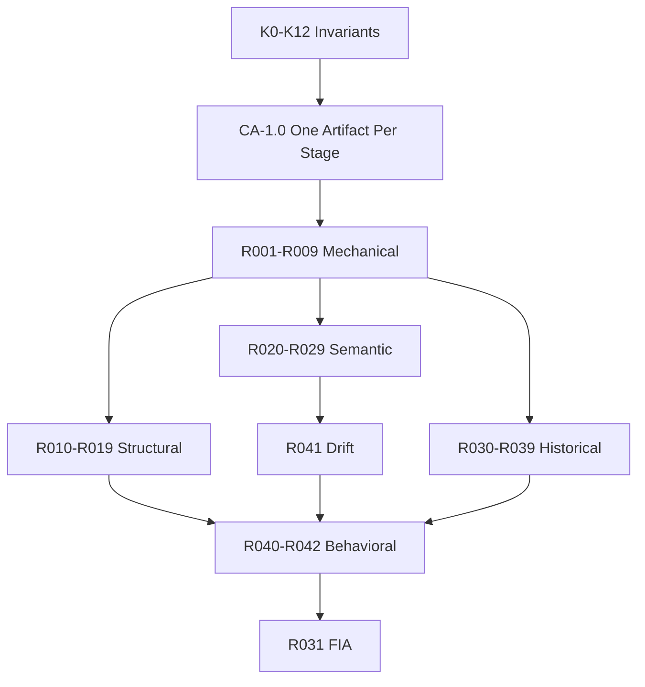

# CRK-1 Requirement Dependency Graph (R001–R042)

**Authority:** CRK-1 Specification v1.0  
**Status:** Normative reference  
**Machine-readable:** [../normative-requirements/catalog.json](../normative-requirements/catalog.json)

This document expresses logical dependencies between normative requirements. It is the human-readable complement to the requirement DAG used for audit ordering.

## Layer model

```
┌─────────────────────────────────────────────────────────────┐
│  K0–K12 Invariants + CA-1.0 (One-Artifact-Per-Stage)      │
└────────────────────────────┬────────────────────────────────┘
                             │
┌────────────────────────────▼────────────────────────────────┐
│  M-Series R001–R009  (Mechanical / loop totality)           │
└────────────────────────────┬────────────────────────────────┘
                             │
        ┌────────────────────┼────────────────────┐
        ▼                    ▼                    ▼
┌───────────────┐   ┌───────────────┐   ┌───────────────┐
│ S-Series      │   │ E-Series      │   │ G-Series      │
│ R010–R019     │   │ R020–R029     │   │ R030–R039     │
│ Structural    │   │ Semantic      │   │ Historical    │
└───────┬───────┘   └───────┬───────┘   └───────┬───────┘
        │                   │                   │
        └───────────────────┼───────────────────┘
                            ▼
                 ┌─────────────────────┐
                 │ D-Series R041       │
                 │ Drift monotonicity  │
                 └──────────┬──────────┘
                            ▼
                 ┌─────────────────────┐
                 │ B-Series R040–R042  │
                 │ Behavioral / loop   │
                 └──────────┬──────────┘
                            ▼
                 ┌─────────────────────┐
                 │ R031 FIA            │
                 │ R032 Supremacy      │
                 └─────────────────────┘
```

## Transformation chain (CA-1.0)

Each edge is one Transformation Contract:

| Edge | Contract | Primary requirements |
|------|----------|---------------------|
| Decision → Outcome | [decision-to-outcome](../transformation-contracts/decision-to-outcome.md) | R001, R005 |
| Outcome → Evidence | [outcome-to-evidence](../transformation-contracts/outcome-to-evidence.md) | R002, R018 |
| Evidence → Interpretation | [evidence-to-interpretation](../transformation-contracts/evidence-to-interpretation.md) | R003, R020 |
| Interpretation → Receipt | [interpretation-to-policy-eval](../transformation-contracts/interpretation-to-policy-eval.md) | R042, R033 |

## Key dependencies

| Requirement | Depends on | Enables |
|-------------|------------|---------|
| R001 Consequence Continuity | R014 (Decision schema) | R002, R040 |
| R002 Evidence Completeness | R001, R015 | R003, R018 |
| R003 Interpretive Exposure | R002, R016 | R020, R040 |
| R004 Replayability | R001–R003 | R021, R025 |
| R010 Structural Transparency | K4 | R012–R017 |
| R011 Contractual Binding | R010 | R018–R019, R027 |
| R012 Traceability | R010 | R036–R037 |
| R020 Semantic Multiplicity | R003, R017 | R023, R029 |
| R021 Semantic Reproducibility | R004, R020 | R025 |
| R022 Drift Visibility | R020 | R041 |
| R030 Provenance Immutability | R033 | R031 |
| R040 Loop Completeness | R001–R003, CA-1.0 | R042 |
| R041 Drift Monotonicity | R022 | C6 |
| R042 Governance Visibility | R033, R040 | R030 |
| R032 Constitutional Supremacy | All | — |

## Mermaid (audit traversal)



## Conformance resolution

Every requirement resolves to CTS tests and evidence via [../../conformance/traceability-matrix.md](../../conformance/traceability-matrix.md).
